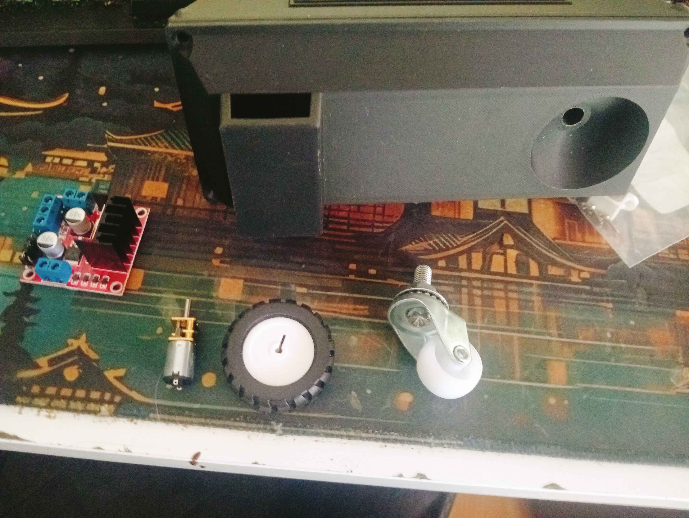

# WifiRover WORK IN PROGRESS
A small, motorized rover platform designed for experimentation with robotics, motor control, and embedded systems. Built for learning and prototyping, this rover combines electronics, mechanical components, and software to demonstrate basic autonomous and remote-controlled functionality.

## Parts List
- 2 x N20 gearmotor drive system (6V, 300 RPM) with 43 mm wheels
- L298N motor driver control
- FreeRTOS-based software for synchronized motor operation
- ESP32 microcontroller for communication and control
- ESP32-S3 Mini 1 MCU
- 3D printed chassis and wheel mounts
- Caster Wheel
- Power supply: 6V battery pack

## Functionality
- Forward, backward, and turning motion
- Motor speed and direction control
- Potential for adding sensors and autonomous navigation

## Subsystems
### Electrical
Microcontroller: ESP32-S3 Mini 1
Motor Driver: L298N dual H-bridge
Motors: 2 × N20 gearmotors (6V, 300 RPM)
Power: 6V battery pack, regulated 3.3V for MCU
Connections: DIR and STEP pins for motor control, shared GND

### Mechanical
Chassis: 3D printed modular frame
Wheels: 2 × 43 mm wheels on N20 motors
Mounts: Motor and wheel mounts, adjustable for alignment
Other: Bearings, screws, and spacers as needed

### Firmware / Software
Real-Time OS: FreeRTOS for synchronized motor control
Control Logic: Forward, backward, and turning movement
Potential Additions: Sensor integration (distance, IMU), telemetry, autonomous routines
